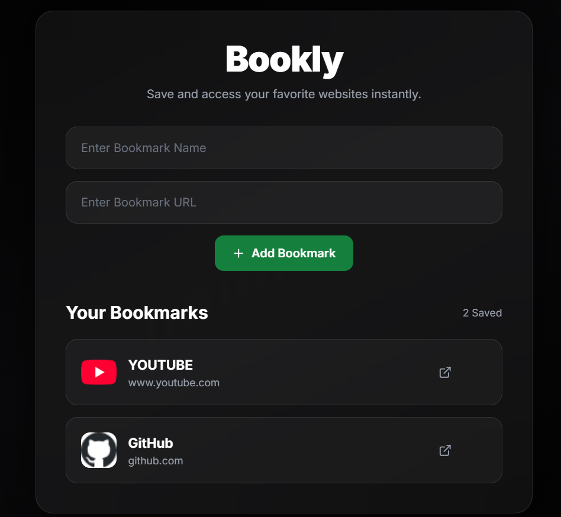

# 🔖 Bookly - Bookmark Manager

A modern bookmark management application built using **Next.js, React, TypeScript, and Tailwind CSS**.

Bookly enables users to save and instantly access their favorite websites through a clean, responsive, and user-friendly interface while leveraging browser Local Storage for persistent client-side data storage.

## 🌐 Live Demo

https://ayeshaas-bm.netlify.app/

---

## ✨ Features

- Save and manage bookmarks
- Persistent Local Storage support
- Instant access to saved links
- Responsive modern UI
- Dynamic bookmark rendering
- Reusable React components
- Minimal dark-themed design

---

## 🚀 Tech Stack

- Next.js 14
- React 18
- TypeScript
- Tailwind CSS
- Lucide React Icons

---

## 📸 Screenshots

---

## 🧠 What I Learned

- Browser Local Storage handling
- Client-side data persistence
- React state management
- Dynamic rendering techniques
- User input handling
- Component-based frontend architecture
- Responsive UI development using Tailwind CSS

This project improved my understanding of frontend interactivity and state-driven user experiences.

---

## 💡 Future Improvements

- Bookmark categories and tags
- Edit and delete functionality
- Search and filtering
- Drag-and-drop organization
- Authentication system
- Cloud database integration
- Import/export support

---

## 👩‍💻 Author

**Ayesha Ansari**

Built with ❤️ using Next.js and Tailwind CSS